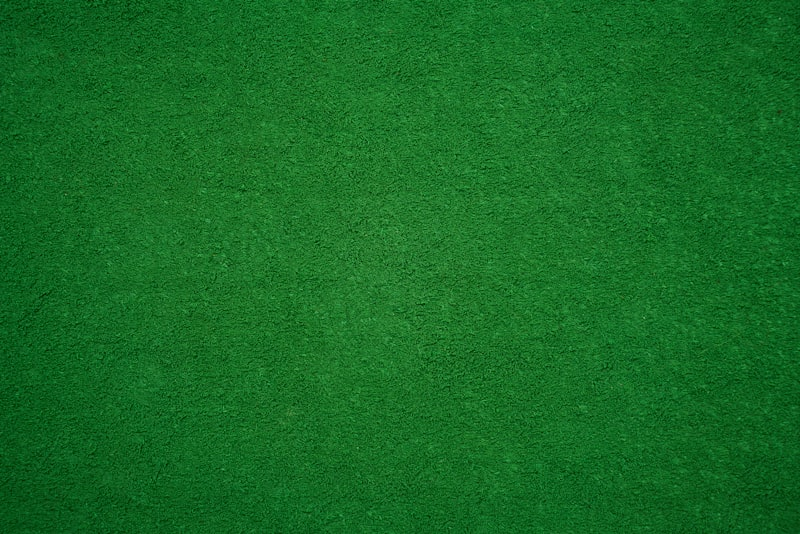

# 🎲 Poker Dice - Modern Online Poker Platform

A sleek and modern online poker platform built with Next.js 14, featuring a stunning UI with glass morphism effects, smooth animations, and responsive design.



## ✨ Features

### 🎮 Game Variants
- **Texas Hold'em** - The world's most popular poker variant
- **Omaha** - Strategic four-card poker
- **Seven Card Stud** - Classic poker variant
- **Speed Poker** - Fast-paced action games

### 🎯 Key Features
- 🎨 Modern UI with glass morphism effects
- ✨ Smooth animations and transitions
- 📱 Fully responsive design
- 🚀 Optimized performance
- 🎭 Interactive elements and hover effects

### 💫 UI Components
- Custom animated navigation
- Interactive game cards
- Floating elements with parallax effects
- Gradient text and buttons
- Animated statistics
- Glass-effect cards

## 🛠 Tech Stack

- **Framework:** Next.js 14
- **Styling:** TailwindCSS
- **Components:** ShadCN
- **Language:** TypeScript
- **Animations:** Custom CSS
- **Assets:** SVG & WebP images

## 🚀 Getting Started

### Prerequisites
- Node.js 18+ 
- npm or yarn

### Installation

1. Clone the repository:
```bash
git clone https://github.com/sandy-gen/hello-mark.git
cd hello-mark
```

2. Install dependencies:
```bash
npm install
# or
yarn install
```

3. Run the development server:
```bash
npm run dev
# or
yarn dev
```

4. Open [http://localhost:3000](http://localhost:3000) in your browser.

## 📱 Responsive Design

The website is fully responsive and optimized for:
- 📱 Mobile devices
- 💻 Tablets
- 🖥 Desktop screens
- 📺 Large displays

## 🎨 Design Features

### Color Scheme
- Primary: Indigo shades
- Accent: Yellow gradients
- Text: White with gray variations
- Backgrounds: Glass morphism effects

### Typography
- Modern sans-serif fonts
- Gradient text effects
- Responsive sizing
- Optimal readability

### Animations
- Floating cards
- Smooth transitions
- Hover effects
- Loading animations
- Parallax scrolling

## 📄 Pages

- **Home** - Hero section with animated elements
- **Games** - Interactive game cards with details
- **About** - Company information and statistics
- **Contact** - Contact form with modern styling

## 🔜 Roadmap

- [ ] Add game lobby interface
- [ ] Implement live chat UI
- [ ] Add tournament brackets
- [ ] Create player profile pages
- [ ] Add dark/light theme toggle

## 📝 License

This project is licensed under the MIT License - see the [LICENSE](LICENSE) file for details.

## 🤝 Contributing

Contributions are welcome! Feel free to submit a Pull Request.

---

Built with ❤️ using Next.js and TailwindCSS
